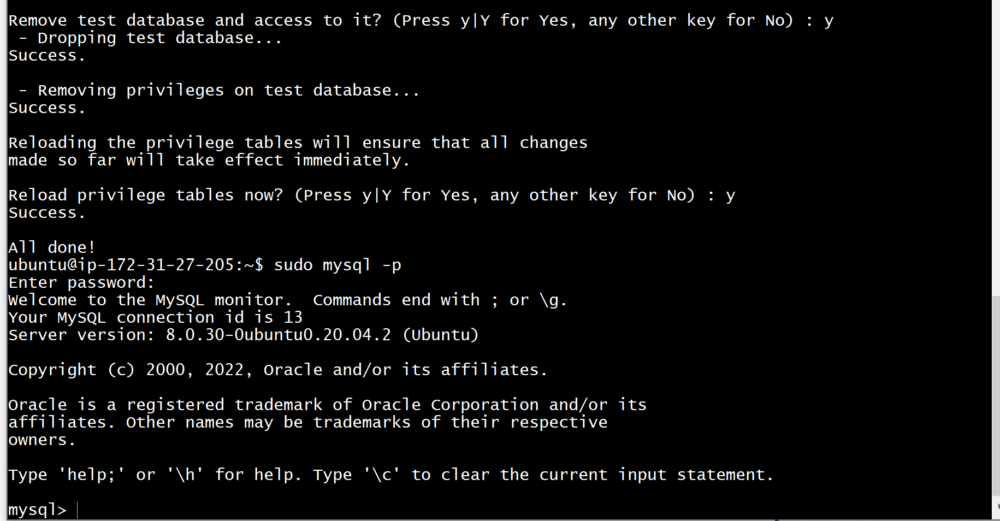

# Guide on LEMP TECH STACK INSTALLATION

## start with NGINIX Server setup, but we must update the server's package list by running the command below. 

## 1st Command used

`sudo apt update`

##install nginix using the command below

`sudo apt-get install nginix`

## check to see if status is running

`sudo systemctl status nginx`

##confirm local access of nginx

`curl http://localhost:80`

# step 2 - mysql setup

## confirm you can access nginx from a browser using the url below by replace with my public ip

`http://<Public-IP-Address>:80`

## install mysql server by running command below

`sudo apt install mysql-server -y`

## log on to mysql using command below

`sudo mysql`

## run security script on mysql to remove some insecure default setups and lock down access to your DB

`ALTER USER 'root'@'localhost' IDENTIFIED WITH mysql_native_password BY 'PassWord.1';`

## start preinstalled script that comes with mysql

`sudo mysql_secure_installation`

## php setup

## setup php interpreter for PHP interaction with Nginx and a module for php communication with mysql

`sudo apt install php-fpm php-mysql`

## create directory to setup another website within nginx

`sudo mkdir /var/www/projectLEMP`

## give neccessary permission to the folder

`sudo chown -R $USER:$USER /var/www/projectLEMP`

##update the the nano file for the website configuration details and link the file to the nginx sites-enabled directory

`sudo ln -s /etc/nginx/sites-available/projectLEMP /etc/nginx/sites-enabled/`

## test configuration for syntax error using the code below

`sudo nginx -t`

##disable nginx host configured to listen on port 80 using the code below

`sudo unlink /etc/nginx/sites-enabled/default`

## then reload nginx to apply changes

`sudo systemctl reload nginx`

## test to access temperal website using the url

## also ensure the php connection socket to nginx is same as the one configured in the config file and the one in the domain folder

## Run the url below update the public ip section with the Instance IP.

`http://`server_domain_or_IP`/info.php`

## remember to remove the file that shows the php infomation as it contains sensitive information. use script below.

`sudo rm /var/www/your_domain/info.php`

## step 6 retrieving data from Mysql DB with PHP

## logon to mysql with root user account by running commands below, input password and continue

`mysql -u root -p`

## create a new Database and add a user with his logon password to the Database using the scripts below

`CREATE DATABASE 'example_database'`

`CREATE USER 'example_user'@'%' IDENTIFIED WITH mysql_native_password BY 'password'`

## grant user necessary permission to the database (Full priveledges) using the script below

`GRANT ALL ON example_database.* TO 'example_user'@'%'`

## show created created dataabse 

## created the table and the fields using the query below

`CREATE TABLE example_database.todo_list(item_id INT AUTO_INCREMENT, content VARCHAR(255), PRIMARY KEY(item_id));`

## Also inserted a row to the table using the script below

`INSERT INTO example_database.todo_list (content) VALUES ("My first important item");`

## use query below to confirm the addition of the row

`SELECT * FROM exam`

## create php script for mysql connection, update script in configuration file and try to access the page using the url below - update public IP

`http://<Public_domain_or_IP>/todo_list.php`

## php environment ready for connection and interaction

